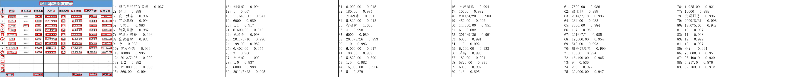

# paddle_ocr_engine
飞桨paddle ocr部署脚本，对官方的脚本中存在的bug、需要配置的项、下载速度，做了进一步的优化。


## 构建镜像
```bash
git clone https://github.com/nickliqian/paddle_ocr_engine.git
cd docker/cpu-avx
docker build -t ppocr:cpu-avx .
```

## 启动容器
```bash
docker run -dt -p 8868:8866 --name ppocr ppocr:cpu-avx
```

## 验证效果
```bash
pip3 install -r requirements.txt
python test_ocr.py
```
执行验证脚本后，返回结果：
```
[{'confidence': 0.9948268532752991, 'text': '可行性研究报告参考大纲', 'text_region': [[193, 8], [409, 8], [409, 33], [193, 33]]}, {'confidence': 0.9960467219352722, 'text': '可行性研究报告一参考大纲', 'text_region': [[630, 23], [874, 23], [874, 49], [630, 49]]}, {'confidence': 0.9841165542602539, 'text': '0.956', 'text_region': [[894, 25], [949, 25], [949, 47], [894, 47]]}, {'confidence': 0.9986761808395386, 'text': '市场分析及产品工艺技术方案', 'text_region': [[1243, 21], [1524, 23], [1524, 45], [1243, 43]]}, {'confidence': 0.9100116491317749, 'text': '0.993', 'text_region': [[1524, 25], [1575, 25], [1575, 45], [1524, 45]]}, {'confidence': 0.6927619576454163, 'text': '第章项目总浴', 'text_region': [[3, 47], [129, 43], [130, 70], [4, 74]]}, {'confidence': 0.9672524333000183, 'text': '第九章劳动安全卫生与消防', 'text_region': [[300, 47], [508, 47], [508, 72], [300, 72]]}, {'confidence': 0.9965267181396484, 'text': '项目经', 'text_region': [[1311, 49], [1386, 49], [1386, 68], [1311, 68]]}, {'confidence': 0.8407450914382935, 'text': '6660', 'text_region': [[724, 55], [765, 55], [765, 68], [724, 68]]}, {'confidence': 0.9383459091186523, 'text': '0.998', 'text_region': [[1509, 51], [1556, 51], [1556, 70], [1509, 70]]}, {'confidence': 0.9512856006622314, 'text': '项目总论0.999', 'text_region': [[630, 72], [785, 68], [786, 93], [630, 98]]}, {'confidence': 0.9955801963806152, 'text': '第五章厂址选择与建设条件', 'text_region': [[1245, 76], [1481, 76], [1481, 95], [1245, 95]]}, {'confidence': 0.9680675268173218, 'text': '0.994', 'text_region': [[1506, 74], [1562, 74], [1562, 94], [1506, 94]]}, {'confidence': 0.8293737173080444, 'text': '第二章项目单位基本情况', 'text_region': [[6, 84], [195, 84], [195, 115], [6, 115]]}, {'confidence': 0.8681997060775757, 'text': '第十章组织机构与人力资源配置', 'text_region': [[302, 84], [538, 84], [538, 115], [302, 115]]}, {'confidence': 0.996086597442627, 'text': '第九章', 'text_region': [[632, 99], [692, 99], [692, 121], [632, 121]]}, {'confidence': 0.9765577912330627, 'text': '第十三章投资估算与资金筹措', 'text_region': [[1243, 97], [1504, 97], [1504, 123], [1243, 123]]}, {'confidence': 0.8902081251144409, 'text': '0.991', 'text_region': [[724, 103], [763, 103], [763, 117], [724, 117]]}, {'confidence': 0.7765446901321411, 'text': '7：', 'text_region': [[1208, 103], [1226, 103], [1226, 117], [1208, 117]]}, {'confidence': 0.9850108027458191, 'text': '0.995', 'text_region': [[1524, 102], [1578, 97], [1579, 118], [1526, 123]]}, {'confidence': 0.9982904195785522, 'text': '生与消防', 'text_region': [[733, 125], [808, 125], [808, 144], [733, 144]]}, {'confidence': 0.9890516996383667, 'text': '0.997', 'text_region': [[827, 125], [887, 125], [887, 146], [827, 146]]}, {'confidence': 0.9023690223693848, 'text': '第十一章项目组织管理与招股标', 'text_region': [[302, 127], [538, 125], [538, 152], [302, 154]]}, {'confidence': 0.8970743417739868, 'text': '劳动安全卫', 'text_region': [[636, 129], [737, 129], [737, 142], [636, 142]]}, {'confidence': 0.9976202845573425, 'text': '第六章', 'text_region': [[1243, 125], [1299, 125], [1299, 144], [1243, 144]]}, {'confidence': 0.8398648500442505, 'text': '第三章顺目提出的依', 'text_region': [[9, 132], [158, 132], [158, 152], [9, 152]]}, {'confidence': 0.7356751561164856, 'text': '及必要料', 'text_region': [[174, 132], [234, 132], [234, 152], [174, 152]]}, {'confidence': 0.9903958439826965, 'text': '660', 'text_region': [[1331, 129], [1369, 129], [1369, 142], [1331, 142]]}, {'confidence': 0.6913961172103882, 'text': '第二', 'text_region': [[638, 152], [660, 152], [660, 166], [638, 166]]}, {'confidence': 0.9957147240638733, 'text': '工程技术方案', 'text_region': [[1245, 148], [1384, 148], [1384, 168], [1245, 168]]}, {'confidence': 0.9938666820526123, 'text': '660', 'text_region': [[1391, 152], [1432, 152], [1432, 166], [1391, 166]]}, {'confidence': 0.8661817312240601, 'text': '第四草市场分析及产品工艺技术方案', 'text_region': [[8, 169], [262, 169], [262, 195], [8, 195]]}, {'confidence': 0.9389552474021912, 'text': '第十二章项目经营管理策略', 'text_region': [[300, 169], [506, 169], [506, 195], [300, 195]]}, {'confidence': 0.99763023853302, 'text': '项目单位基本情况', 'text_region': [[630, 175], [788, 175], [788, 195], [630, 195]]}, {'confidence': 0.9638792276382446, 'text': '0.999', 'text_region': [[812, 175], [868, 175], [868, 197], [812, 197]]}, {'confidence': 0.9984064102172852, 'text': '第十四章财务预测与分析', 'text_region': [[1245, 175], [1459, 175], [1459, 195], [1245, 195]]}, {'confidence': 0.991111159324646, 'text': '0.993', 'text_region': [[1483, 175], [1538, 175], [1538, 195], [1483, 195]]}, {'confidence': 0.9956244230270386, 'text': '第十章0.96', 'text_region': [[634, 201], [763, 201], [763, 220], [634, 220]]}, {'confidence': 0.754124641418457, 'text': '第十二章 投资估算与资金筹错', 'text_region': [[302, 206], [521, 209], [521, 234], [302, 232]]}, {'confidence': 0.8192217350006104, 'text': '第五章厂址选择与建设条件', 'text_region': [[8, 208], [206, 208], [206, 234], [8, 234]]}, {'confidence': 0.9317070245742798, 'text': '第七章0.998', 'text_region': [[1243, 199], [1374, 199], [1374, 224], [1243, 224]]}, {'confidence': 0.983366072177887, 'text': '9：组织机构与人力资源配置', 'text_region': [[598, 222], [861, 220], [861, 245], [598, 247]]}, {'confidence': 0.9883431196212769, 'text': '22', 'text_region': [[1204, 226], [1221, 226], [1221, 243], [1204, 243]]}, {'confidence': 0.9879012703895569, 'text': '0.99', 'text_region': [[881, 230], [924, 230], [924, 243], [881, 243]]}, {'confidence': 0.8366708755493164, 'text': '节能', 'text_region': [[1247, 224], [1275, 224], [1275, 245], [1247, 245]]}, {'confidence': 0.9963769912719727, 'text': '660', 'text_region': [[1309, 230], [1352, 230], [1352, 243], [1309, 243]]}, {'confidence': 0.9837270975112915, 'text': '0.99', 'text_region': [[883, 249], [930, 249], [930, 269], [883, 269]]}, {'confidence': 0.9984352588653564, 'text': '第十五', 'text_region': [[1245, 249], [1309, 249], [1309, 269], [1245, 269]]}, {'confidence': 0.9800331592559814, 'text': '23', 'text_region': [[1204, 251], [1221, 251], [1221, 267], [1204, 267]]}, {'confidence': 0.9976384043693542, 'text': '章项目风险分析及对策', 'text_region': [[1301, 249], [1498, 249], [1498, 269], [1301, 269]]}, {'confidence': 0.9705901145935059, 'text': '项目提出的依据', 'text_region': [[636, 253], [780, 253], [780, 267], [636, 267]]}, {'confidence': 0.9957861304283142, 'text': '及必要性', 'text_region': [[776, 253], [859, 253], [859, 267], [776, 267]]}, {'confidence': 0.982423722743988, 'text': '0.99', 'text_region': [[1524, 251], [1573, 251], [1573, 271], [1524, 271]]}, {'confidence': 0.9212061762809753, 'text': '第六章工程技术方案', 'text_region': [[5, 261], [157, 259], [158, 286], [6, 288]]}, {'confidence': 0.8416528701782227, 'text': '第十四草 财务预测与分粉', 'text_region': [[308, 261], [493, 261], [493, 286], [308, 286]]}, {'confidence': 0.9990489482879639, 'text': '第三章', 'text_region': [[645, 277], [731, 277], [731, 296], [645, 296]]}, {'confidence': 0.707663357257843, 'text': '1：', 'text_region': [[606, 279], [632, 279], [632, 292], [606, 292]]}, {'confidence': 0.6525402069091797, 'text': '第七草带能', 'text_region': [[8, 300], [103, 300], [103, 325], [8, 325]]}, {'confidence': 0.997062087059021, 'text': '章项目组织管理与招投标', 'text_region': [[703, 300], [932, 300], [932, 319], [703, 319]]}, {'confidence': 0.9437347650527954, 'text': '第十五草项目风险分析及对策', 'text_region': [[309, 304], [521, 304], [521, 323], [309, 323]]}, {'confidence': 0.9680593013763428, 'text': '0.99', 'text_region': [[949, 304], [992, 304], [992, 318], [949, 318]]}, {'confidence': 0.9383968114852905, 'text': '2', 'text_region': [[609, 308], [621, 308], [621, 318], [609, 318]]}, {'confidence': 0.9924541115760803, 'text': '不境保护', 'text_region': [[1249, 302], [1314, 302], [1314, 316], [1249, 316]]}, {'confidence': 0.9990269541740417, 'text': '第四章', 'text_region': [[641, 325], [701, 325], [701, 345], [641, 345]]}, {'confidence': 0.9972195029258728, 'text': '第十六章结论与建议', 'text_region': [[1241, 325], [1421, 321], [1421, 341], [1242, 345]]}, {'confidence': 0.9963893890380859, 'text': '660', 'text_region': [[729, 327], [772, 327], [772, 341], [729, 341]]}, {'confidence': 0.9522024393081665, 'text': '0.998', 'text_region': [[1446, 325], [1494, 325], [1494, 345], [1446, 345]]}, {'confidence': 0.7402282357215881, 'text': '第八章', 'text_region': [[9, 341], [54, 341], [54, 362], [9, 362]]}, {'confidence': 0.9952476620674133, 'text': '环境保', 'text_region': [[49, 347], [116, 347], [116, 360], [49, 360]]}, {'confidence': 0.9212453365325928, 'text': '第十六章结论与建设', 'text_region': [[306, 339], [456, 339], [456, 364], [306, 364]]}]
draw boxes and texts!
The visualized image saved in ./server_results/154.jpg
```
同时，在`server_results`目录下可以看到识别结果的图片`154.jpg`：
